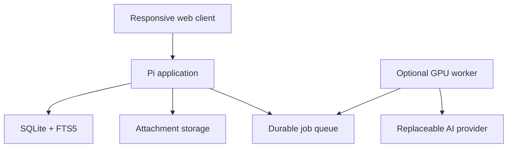

# Architecture

Status: Draft  
Last updated: 2026-09-13

## 1. Purpose

Local AI Notes is a local-first note platform. Ordinary note-taking is the product foundation; AI is an optional client of controlled application capabilities.

## 2. Architectural invariants

1. Human-owned information remains recoverable without AI.
2. Original input is never silently destroyed by AI processing.
3. Every AI modification is attributable and reversible.
4. Canonical data is separated from regenerable derived data.
5. UI and AI actions use the same application capability layer.
6. Models, prompts, storage locations, and hardware are replaceable.
7. The application remains useful while every AI service is offline.
8. Personal deployment configuration never becomes a source-code assumption.

## 3. System context



The web application, database, and attachment store form the core system. The remote worker and model provider are optional.

## 4. Initial technology direction

- FastAPI application with Pydantic validation and SQLAlchemy persistence.
- SQLite with FTS5 as the initial system of record and lexical search engine.
- Alembic migrations from the first schema.
- Server-rendered, progressively enhanced responsive UI; HTMX is the initial candidate.
- Docker Compose deployment on Raspberry Pi OS/OMV storage.
- Tailscale for private network reachability, plus application authentication.
- A SQLite-backed job queue before introducing Redis or a dedicated broker.

These are design directions, not irrevocable choices. Significant changes require an architecture decision record.

## 5. Canonical and derived data

SQLite is authoritative for notes, accepted metadata, revisions, relationships, jobs, and audit records. Attachments are files referenced by stable database identifiers.

Canonical note bodies use a Markdown-compatible representation; opaque editor HTML is not authoritative. Markdown, JSON, and CSV are export formats rather than a second writable source of truth.

Derived data includes embeddings, vector indexes, thumbnails, cached summaries, OCR indexes, and saved query caches. Derived artifacts must be rebuildable from canonical records and retained source material.

## 6. Identity, history, and provenance

- Notes, revisions, attachments, jobs, tags, and other durable objects receive stable UUID-compatible IDs.
- Substantive changes create immutable revisions.
- Deletes are soft and restorable by default.
- Mutations record actor type, actor ID where applicable, origin, timestamp, and correlation/request ID.
- Imported, photographed, dictated, clipped, or scanned material retains its source artifact and extraction lineage.

## 7. Capability layer

Business operations are ordinary application services, initially including:

- notes: create, read, update, append, archive, restore, move, duplicate;
- organization: notebooks, tags, properties, links, backlinks;
- retrieval: FTS search, filters, saved queries;
- attachments and exports;
- revision history and comparison.

Routes and UI handlers call these services. Future REST tool adapters and MCP adapters wrap the same services. Models receive no direct SQL or arbitrary filesystem access.

Capabilities will declare a risk class: read-only, reversible write, significant/bulk write, or destructive. Bulk and destructive operations require preview and/or explicit confirmation.

## 8. Ingestion and AI boundary

Typed text is the first input adapter. Images, PDFs, handwriting OCR, audio transcription, and web clips later converge into the same ingestion pipeline.

AI access is isolated behind provider interfaces for structured generation, chat, embeddings, vision, and transcription. Provider configuration uses environment or secret storage, not committed values.

Jobs are durable and idempotent, with stable IDs, deduplication keys, status, attempts, timestamps, leases, result references, and error details. Workers claim jobs over an authenticated interface and return structured results for validation before mutation.

## 9. AI provenance and future training

When AI integration begins, retain:

- raw input and source references;
- retrieved context and its identifiers;
- model, model revision, quantization, provider, and inference settings;
- prompt and tool-schema versions;
- proposed output and tool calls;
- validation results, user decision, user edits, and final accepted result;
- latency, failures, and correlation IDs.

Training/evaluation exports must be explicit, reviewable, and privacy-aware. User content is never uploaded or published by default.

## 10. Security and privacy

- Tailscale is a network boundary, not the sole authentication mechanism.
- Authorization is enforced in application services as well as routes.
- State-changing requests use CSRF defenses where applicable.
- Uploads receive type, size, path, and malware-aware validation.
- Rendered Markdown and imported content are sanitized.
- Secrets and personal deployment details remain outside Git.
- Logs avoid note bodies, prompts, credentials, and attachment contents by default.
- Backups are encrypted where practical and restoration is tested.

See [SECURITY.md](../SECURITY.md) for reporting policy. A detailed threat model will precede remote AI write operations.

## 11. Operations and durability

Backup, export, and sync are separate systems. Initial deployment supports backups and exports; multi-device offline synchronization is deferred.

The application exposes health/readiness checks and structured logs. Operational state will eventually cover migrations, storage availability, backup recency, queue depth, worker connectivity, and index status.

## 12. Explicitly deferred

- CRDT or offline multi-writer synchronization;
- full event sourcing;
- graph databases and broad entity ontologies;
- dedicated vector databases;
- Redis/Celery-class queue infrastructure;
- MCP as an internal architectural dependency;
- arbitrary Notion-style block databases;
- autonomous destructive AI operations.

## 13. Proposed repository boundaries

```text
src/local_ai_notes/
  api/             HTTP routes and schemas
  application/     capabilities and orchestration
  domain/          core rules and types
  infrastructure/  persistence, files, providers
  web/             templates and static assets
tests/
docs/adr/
migrations/
```

This structure is provisional until the first vertical slice tests it.
